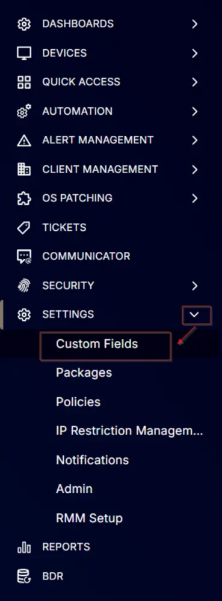
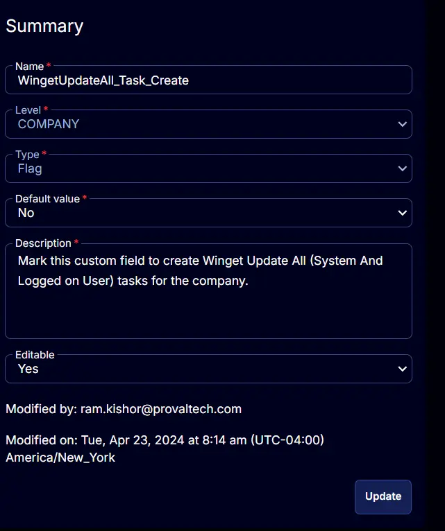

## Summary

Mark this custom field to create Winget Update All (System and Logged on User) tasks for the company's Windows 10 and 11 computers.

Marking this custom field will automatically add the machines to the [CW RMM - Machine Group - Winget Update All (Task Create)](/docs/22ee8d54-e19d-4b47-9ccd-c45c259f8fb7) group.

This custom field must be marked at the company level to run the [CW RMM - Task - Scheduled Task Winget Update All (Create)](/docs/a898b5ac-23d0-4e0d-89e5-79bca2277a6e) task.

## Details

| Field Name                     | Level  | Type | Default Value | Description                                                                 | Editable |
|--------------------------------|--------|------|---------------|-----------------------------------------------------------------------------|----------|
| WingetUpdateAll_Task_Create    | COMPANY | Flag | No            | Mark this custom field to create Winget Update All (System and Logged on User) tasks for the company. | Yes      |

## Screenshot

