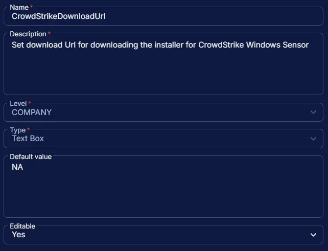

## Summary

Set download Url for downloading the installer for CrowdStrike Windows Sensor.

## Dependencies

- [DeployCrowdStrikeWindowsSensor](/docs/ffe13fcc-700f-41ea-9fdf-20ea4d253326)
- [CrowdStrikeCustomerId](/docs/28f5fdfd-c11e-4643-ae07-62d6f7007805)
- [Solution: Deploy CrowdStrike Windows Sensor](/docs/dec6391a-c159-4b45-8c3a-9df4d88dd1c5)

## Custom Field Setup Location

**Custom Fields Path:** `SETTINGS` ➞ `Custom Fields`  

## Details

| Name | Level | Type | Default Value | Editable | Description |
| ---- | ----- | ---- | ------------- | -------- | ----------- |
| CrowdStrikeCustomerId | COMPANY | Text Box | NA | Yes | Set download Url for downloading the installer for CrowdStrike Windows Sensor. |

## Completed Custom Field

