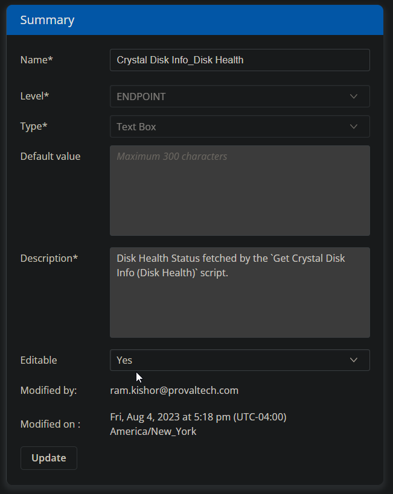

## Summary

This custom field is used to store and display the results of the [CW RMM - Task - Get Crystal Disk Info (Disk Health)](/docs/37220488-64d2-4de9-8e65-1cd53f5dee3b) task.

## Dependencies

[CW RMM - Task - Get Crystal Disk Info (Disk Health)](/docs/37220488-64d2-4de9-8e65-1cd53f5dee3b)

## Details

| Field Name                         | Type of Field (Machine or Organization) | Description                                                                                     |
|------------------------------------|-----------------------------------------|-------------------------------------------------------------------------------------------------|
| Crystal Disk Info_Disk Health      | Machine                                 | Disk Health Status fetched by the [Get Crystal Disk Info (Disk Health)](/docs/37220488-64d2-4de9-8e65-1cd53f5dee3b) script. |

## Screenshot

## Sample Value

