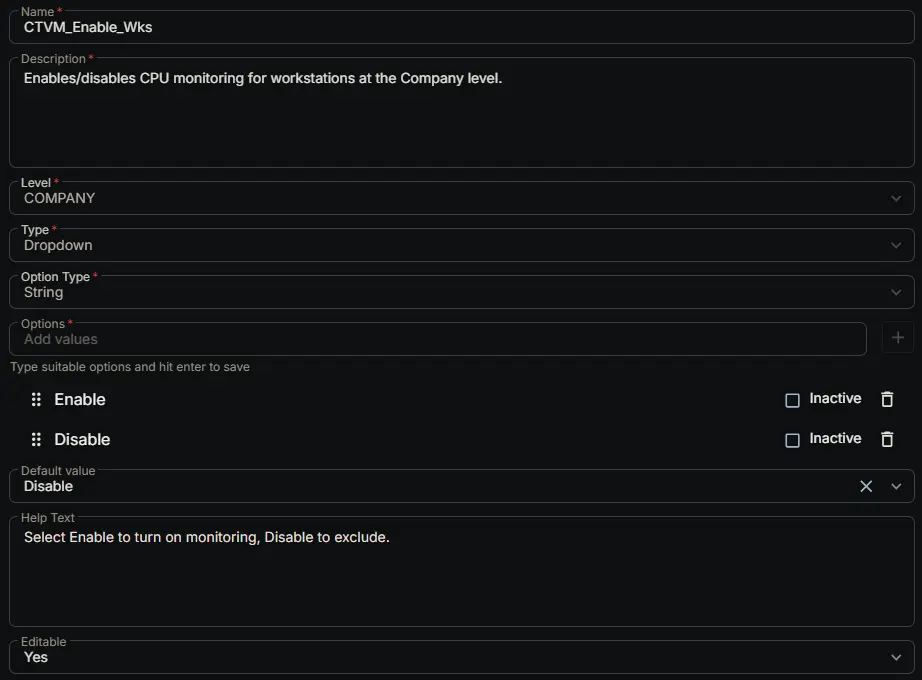

---
id: '5b985126-3e3d-4b86-b306-5a93381df895'
slug: /5b985126-3e3d-4b86-b306-5a93381df895
title: 'CTVM_Enable_Wks'
title_meta: 'CTVM_Enable_Wks'
keywords: ['cpu', 'monitoring', 'windows', 'alerts', 'thresholds', 'performance']
description: 'Enables/disables CPU monitoring for workstations at the Company level.'
tags: ['performance', 'monitoring', 'windows']
draft: false
unlisted: false
last_update:
  date: 2026-07-01
---

## Summary

Enables/disables CPU monitoring for workstations at the Company level.

## Dependencies

- [Solution: CPU Threshold Violation Monitoring](/docs/49b06af7-af3b-4aaa-a90c-8efb28a65c9e)

## Custom Field Setup Location

**Custom Fields Path:** SETTINGS ➞ Custom Fields

## Details

| Name | Description | Level | Type | Option Type | Options | Help Text | Default Value | Editable |
|---|---|---|---|---|---|---|---|---|
| CTVM_Enable_Wks | Enables/disables CPU monitoring for workstations at the Company level. | `Company` | `Dropdown` | `string` | `Enable`, `Disable` | Select Enable to turn on monitoring, Disable to exclude. | `Disable` | `Yes` |

## Completed Custom Field

## Changelog

### 2026-07-01

- Initial version of the document
