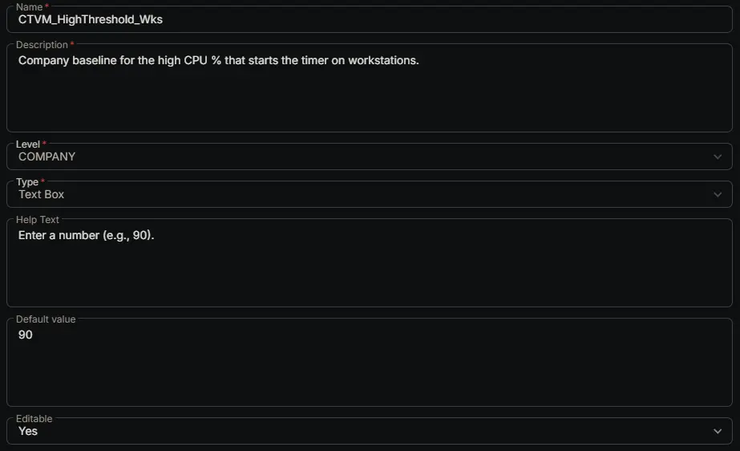

---
id: '9828050e-4ca5-492e-a61f-97a9462a3de0'
slug: /9828050e-4ca5-492e-a61f-97a9462a3de0
title: 'CTVM_HighThreshold_Wks'
title_meta: 'CTVM_HighThreshold_Wks'
keywords: ['cpu', 'monitoring', 'windows', 'alerts', 'thresholds', 'performance']
description: 'Company baseline for the high CPU % that starts the timer on workstations.'
tags: ['performance', 'monitoring', 'windows']
draft: false
unlisted: false
last_update:
  date: 2026-07-01
---

## Summary

Company baseline for the high CPU % that starts the timer on workstations.

## Dependencies

- [Solution: CPU Threshold Violation Monitoring](/docs/49b06af7-af3b-4aaa-a90c-8efb28a65c9e)

## Custom Field Setup Location

**Custom Fields Path:** SETTINGS ➞ Custom Fields

## Details

| Name | Description | Level | Type | Help Text | Default Value | Editable |
|---|---|---|---|---|---|---|
| CTVM_HighThreshold_Wks | Company baseline for the high CPU % that starts the timer on workstations. | `Company` | `Text Box` | Enter a number (e.g., 90). | `90` | `Yes` |

## Completed Custom Field

## Changelog

### 2026-07-01

- Initial version of the document
