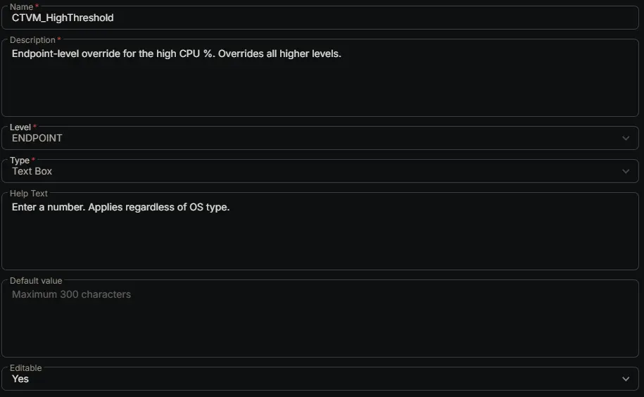

---
id: '9c3a9dff-a7f0-4a97-91a5-8e41f035c1e9'
slug: /9c3a9dff-a7f0-4a97-91a5-8e41f035c1e9
title: 'CTVM_HighThreshold'
title_meta: 'CTVM_HighThreshold'
keywords: ['cpu', 'monitoring', 'windows', 'alerts', 'thresholds', 'performance']
description: 'Endpoint-level override for the high CPU %. Overrides all higher levels.'
tags: ['performance', 'monitoring', 'windows']
draft: false
unlisted: false
last_update:
  date: 2026-07-01
---

## Summary

Endpoint-level override for the high CPU %. Overrides all higher levels.

## Dependencies

- [Solution: CPU Threshold Violation Monitoring](/docs/49b06af7-af3b-4aaa-a90c-8efb28a65c9e)

## Custom Field Setup Location

**Custom Fields Path:** SETTINGS ➞ Custom Fields

## Details

| Name | Description | Level | Type | Help Text | Default Value | Editable |
|---|---|---|---|---|---|---|
| CTVM_HighThreshold | Endpoint-level override for the high CPU %. Overrides all higher levels. | `Endpoint` | `Text Box` | Enter a number. Applies regardless of OS type. |  | `Yes` |

## Completed Custom Field

## Changelog

### 2026-07-01

- Initial version of the document
