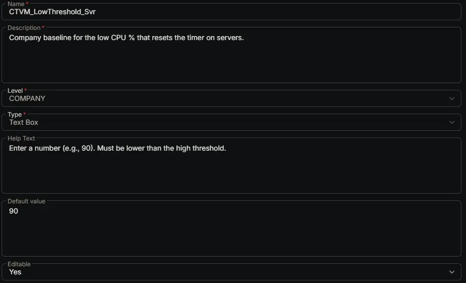

---
id: '59b3f03e-9f6c-4ef7-9e9f-f6b69df4cf7a'
slug: /59b3f03e-9f6c-4ef7-9e9f-f6b69df4cf7a
title: 'CTVM_LowThreshold_Svr'
title_meta: 'CTVM_LowThreshold_Svr'
keywords: ['cpu', 'monitoring', 'windows', 'alerts', 'thresholds', 'performance']
description: 'Company baseline for the low CPU % that resets the timer on servers.'
tags: ['performance', 'monitoring', 'windows']
draft: false
unlisted: false
last_update:
  date: 2026-07-01
---

## Summary

Company baseline for the low CPU % that resets the timer on servers.

## Dependencies

- [Solution: CPU Threshold Violation Monitoring](/docs/49b06af7-af3b-4aaa-a90c-8efb28a65c9e)

## Custom Field Setup Location

**Custom Fields Path:** SETTINGS ➞ Custom Fields

## Details

| Name | Description | Level | Type | Help Text | Default Value | Editable |
|---|---|---|---|---|---|---|
| CTVM_LowThreshold_Svr | Company baseline for the low CPU % that resets the timer on servers. | `Company` | `Text Box` | Enter a number (e.g., 90). Must be lower than the high threshold. | `90` | `Yes` |

## Completed Custom Field

## Changelog

### 2026-07-01

- Initial version of the document
