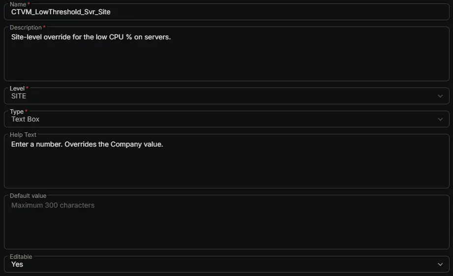

---
id: 'c81ccbcc-b7c0-4c61-b53b-4f096dfaf1e5'
slug: /c81ccbcc-b7c0-4c61-b53b-4f096dfaf1e5
title: 'CTVM_LowThreshold_Svr_Site'
title_meta: 'CTVM_LowThreshold_Svr_Site'
keywords: ['cpu', 'monitoring', 'windows', 'alerts', 'thresholds', 'performance']
description: 'Site-level override for the low CPU % on servers.'
tags: ['performance', 'monitoring', 'windows']
draft: false
unlisted: false
last_update:
  date: 2026-07-01
---

## Summary

Site-level override for the low CPU % on servers.

## Dependencies

- [Solution: CPU Threshold Violation Monitoring](/docs/49b06af7-af3b-4aaa-a90c-8efb28a65c9e)

## Custom Field Setup Location

**Custom Fields Path:** SETTINGS ➞ Custom Fields

## Details

| Name | Description | Level | Type | Help Text | Default Value | Editable |
|---|---|---|---|---|---|---|
| CTVM_LowThreshold_Svr_Site | Site-level override for the low CPU % on servers. | `Site` | `Text Box` | Enter a number. Overrides the Company value. |  | `Yes` |

## Completed Custom Field

## Changelog

### 2026-07-01

- Initial version of the document
