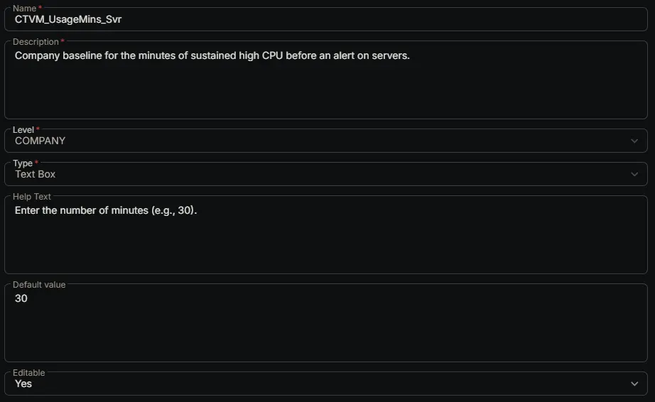

---
id: '86db6615-4751-4c40-8018-53be3ed9db13'
slug: /86db6615-4751-4c40-8018-53be3ed9db13
title: 'CTVM_UsageMins_Svr'
title_meta: 'CTVM_UsageMins_Svr'
keywords: ['cpu', 'monitoring', 'windows', 'alerts', 'thresholds', 'performance']
description: 'Company baseline for the minutes of sustained high CPU before an alert on servers.'
tags: ['performance', 'monitoring', 'windows']
draft: false
unlisted: false
last_update:
  date: 2026-07-01
---

## Summary

Company baseline for the minutes of sustained high CPU before an alert on servers.

## Dependencies

- [Solution: CPU Threshold Violation Monitoring](/docs/49b06af7-af3b-4aaa-a90c-8efb28a65c9e)

## Custom Field Setup Location

**Custom Fields Path:** SETTINGS ➞ Custom Fields

## Details

| Name | Description | Level | Type | Help Text | Default Value | Editable |
|---|---|---|---|---|---|---|
| CTVM_UsageMins_Svr | Company baseline for the minutes of sustained high CPU before an alert on servers. | `Company` | `Text Box` | Enter the number of minutes (e.g., 30). | `30` | `Yes` |

## Completed Custom Field

## Changelog

### 2026-07-01

- Initial version of the document
