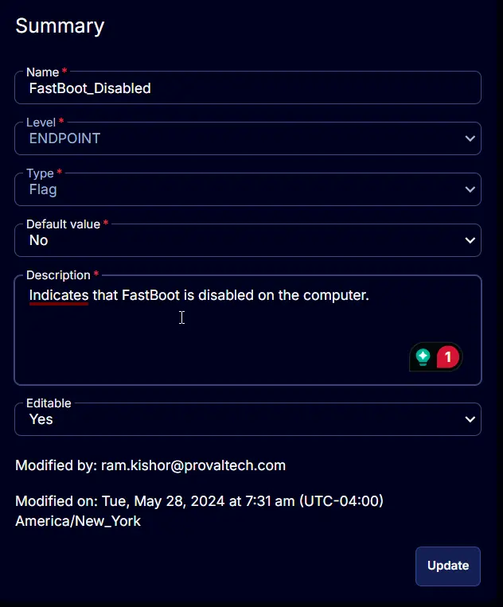

## Summary

Check this box to enable the solution to disable fastboot on the client's Windows workstations.

## Details

| Field Name       | Level  | Type  | Default Value | Description                                                                 | Editable |
|------------------|--------|-------|---------------|-----------------------------------------------------------------------------|----------|
| Disable_FastBoot | COMPANY| Flag  | No            | Check this box to enable the solution to disable fastboot on the client's Windows workstations. | Yes      |

## Screenshot

  

