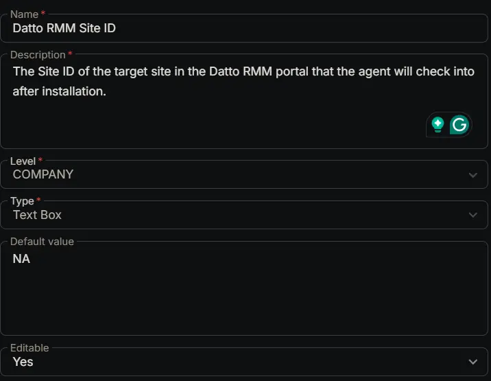

## Summary

The Site ID of the target site in the Datto RMM portal that the agent will check into after installation.

## How to retrieve Site ID

In the Datto RMM portal, go to the `Settings` page for the site you want to look up, then scroll down until you find the `Site ID` option.

**Site ID Path:** `Sites` > `<Desired Site>` > `Settings` > `Site ID`

## Dependencies

- [Solution : Deploy Datto RMM Agent](/docs/b646e989-5515-4bda-9728-107ac03cdc07)

## Custom Field Setup Location

**Custom Fields Path:** `SETTINGS` ➞ `Custom Fields`  

## Details

| Name | Level | Type | Default Value | Editable | Description |
| ---- | ----- | ---- | ------------- | -------- | ----------- |
| Datto RMM Site ID | COMPANY | Text Box | NA | Yes | The Site ID of the target site in the Datto RMM portal that the agent will check into after installation. |

## Completed Custom Field

