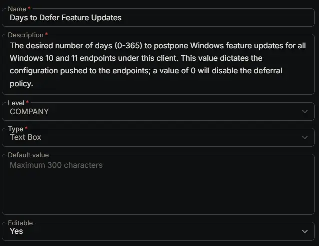

## Summary

The desired number of days (0-365) to postpone Windows feature updates for all Windows 10 and 11 endpoints under this client. This value dictates the configuration pushed to the endpoints; a value of 0 will disable the deferral policy.

## Dependencies

- [Solution: Manage Feature Update Deferral](/docs/800f96cd-5e64-48dd-bb9a-f17822db38e8)

## Custom Field Setup Location

**Custom Fields Path:** `SETTINGS` ➞ `Custom Fields`  

## Details

| Name | Level | Type | Options | Default Value | Editable | Description |
| ---- | ----- | ---- | ------- | ------------- | -------- | ----------- |
| Days to Defer Feature Updates | COMPANY | Text Box | | | Yes | The desired number of days (0-365) to postpone Windows feature updates for all Windows 10 and 11 endpoints under this client. This value dictates the configuration pushed to the endpoints; a value of 0 will disable the deferral policy. |

## Completed Custom Field

## Changelog

### 2026-03-11

- Initial version of the document
