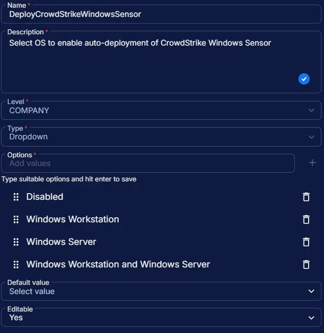

## Summary

Select OS to enable auto-deployment of CrowdStrike Windows Sensor. However, the [Install CrowdStrike Windows Sensor](/docs/7eb5860d-08e2-41cb-b22b-48505618f1ae) task can still be run manually, independent of this field.

## Dependencies

- [Solution: Deploy CrowdStrike Windows Sensor](/docs/dec6391a-c159-4b45-8c3a-9df4d88dd1c5)

## Custom Field Setup Location

**Custom Fields Path:** `SETTINGS` ➞ `Custom Fields`  

## Details

| Name | Level | Type | Options | Default Value | Editable | Description |
| ---- | ----- | ---- | ------- | ------------- | -------- | ----------- |
| DeployCrowdStrikeWindowsSensor | COMPANY | Dropdown | <ul><li>Disabled</li><li>Windows Workstation</li><li>Windows Server</li><li>Windows Workstation and Windows Server</li></ul> |  | Yes | Select OS to enable auto-deployment of CrowdStrike Windows Sensor. |

## Completed Custom Field

