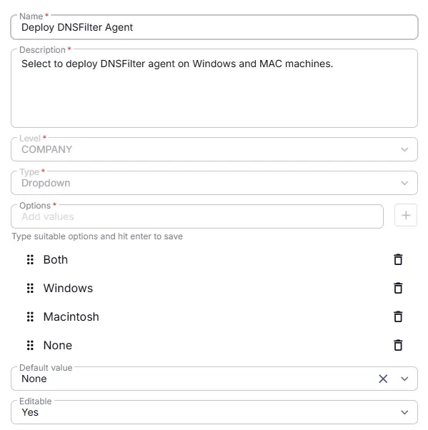

## Summary
Select to deploy DNSFilter agent on Windows and MAC machines.

## Dependencies

- [Solution - DNS Filter Agent Deployment](/docs/fd6fcda6-9a87-4275-b6eb-1a8f8f63099d)

## Details

| Name | Level | Type | Options | Default  | Editable | Description |
|------|-------|------|---------|---------|----------|-------------|
| Deploy DNSFilter Agent | COMPANY | Dropdown | <ul><li>None</li><li>Both</li><li>Windows</li><li>Macintosh</li></ul> | None |  Yes | Select OS to deploy DNSFilter agent on Windows and MAC machines.|

## Completed Custom Field

## Changelog

### 2026-02-18

- Initial version of the document
