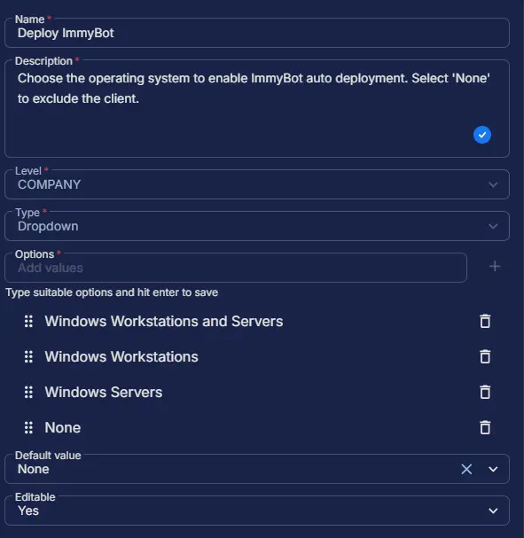

## Summary

Select the operating system to enable automatic deployment via ImmyBot. This custom field manages the auto-execution of the task. However, the [Install ImmyBot Agent](/docs/569083f6-86cd-43ee-ae87-54a050c87951) task can still be run manually, independent of this field.

## Dependencies

## Custom Field Setup Location

**Custom Fields Path:** `SETTINGS` ➞ `Custom Fields`  

## Details

| Name | Level | Type | Options | Default Value | Editable | Description |
| ---- | ----- | ---- | ------- | ------------- | -------- | ----------- |
| Deploy ImmyBot | COMPANY | Dropdown | <ul><li>Windows Workstations and Servers</li><li>Windows Workstations</li><li>Windows Servers</li><li>None</li></ul> | None | Yes | Choose the operating system to enable ImmyBot auto deployment. Select 'None' to exclude the client. |

## Completed Custom Field

