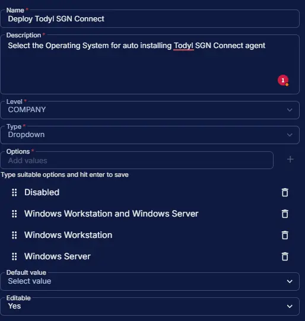

## Summary

Select the Operating System for auto installing Todyl SGN Connect agent. However, the [install Todyl SGN Connect](/docs/c23cdc78-f90e-4aba-b77e-4dff9d612940) task can still be run manually, independent of this field.

## Dependencies

- [Solution: Todyl SGN Connect Deployment](/docs/41308550-ea69-4cca-aa0d-9e6f02fcab43)

## Custom Field Setup Location

**Custom Fields Path:** `SETTINGS` ➞ `Custom Fields`  

## Details

| Name | Level | Type | Options | Default Value | Editable | Description |
| ---- | ----- | ---- | ------- | ------------- | -------- | ----------- |
| Deploy Todyl SGN Connect | COMPANY | Dropdown | <ul><li>Disabled</li><li>Windows Workstation and Windows Server</li><li>Windows Workstation</li><li>Windows Server</li></ul> |  | Yes | Select the Operating System for auto installing Todyl SGN Connect agent. |

## Completed Custom Field

