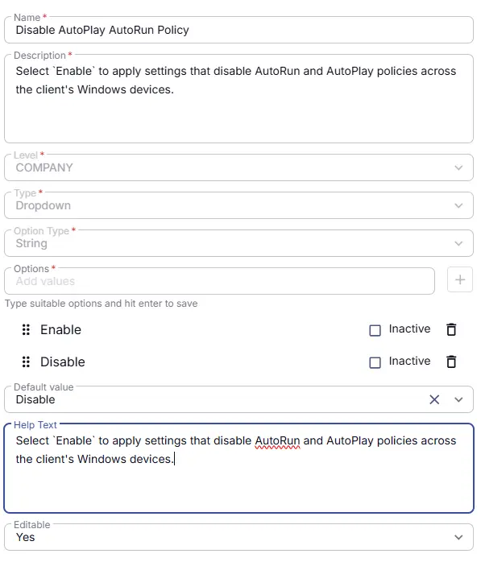

## Summary

Select this Custom Field to apply settings that disables AutoRun and AutoPlay policies across the client's Windows devices.

## Details

| Name                 | Level                | Type      |  Default  | Help Text    | Editable | Description     |
|----------------------|----------------------|----|----------|---------|---------|-------------|
| Disable AutoPlay AutoRun Policy | Company | Flag | No | Select this Custom Field to apply settings that disable AutoRun and AutoPlay policies across the client's Windows devices. |  Yes  | Select this Custom Field to apply settings that disables AutoRun and AutoPlay policies across the client's Windows devices. |

## Dependencies

- [Solution - Disable AutoRun AutoPlay policies](/docs/4bfb0532-45a1-41b8-8e69-d552bae1d12d) 

## Completed Custom Field

## Changelog

### 2026-06-25

- Initial version of the document
