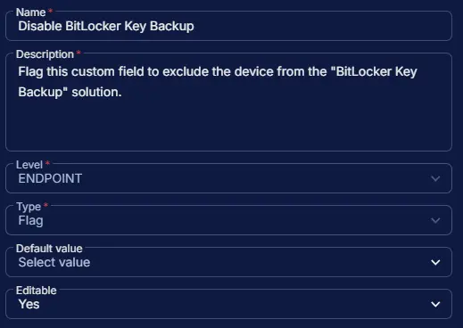

## Summary

Flag this custom field to exclude the endpoint from [BitLocker Key Backup](/docs/fecda0ff-5a3e-4cc5-b6a7-fd37732aa2e9) solution. This custom field manages the auto-execution of the task. However, the [BitLocker Recovery Key Backup](/docs/b469ea90-0c1b-421b-89e2-be5c91501035) task can still be run manually, independent of this field.

## Dependencies

- [Custom Field - Enable BitLocker Key Backup](/docs/14c8ed9d-5357-432d-a8f2-8d522ac9f991)
- [Solution - BitLocker Key Backup](/docs/fecda0ff-5a3e-4cc5-b6a7-fd37732aa2e9)

## Custom Field Setup Location

**Custom Fields Path:** `SETTINGS` ➞ `Custom Fields`  

## Details

| Name | Level | Type | Options | Default Value | Editable | Description |
| ---- | ----- | ---- | ------- | ------------- | -------- | ----------- |
| Disable BitLocker Key Backup | ENDPOINT | Flag | | | Yes | Flag this custom field to exclude the endpoint from "BitLocker Key Backup" solution. |

## Completed Custom Field

