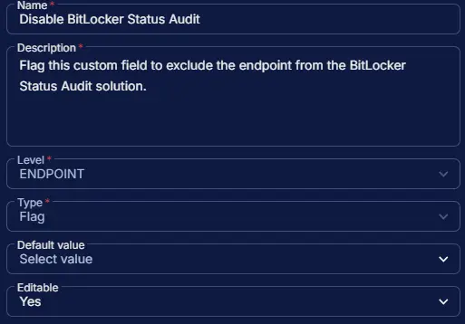

## Summary

Flag this custom field to exclude the endpoint from the [BitLocker Status and Recovery Key Audit](/docs/b2a974b2-c231-4197-a639-d0775d77d7c7) solution. This custom field manages the auto-execution of the task. However, the [BitLocker Status and Recovery Key Audit](/docs/9682b5a8-d821-43f6-9b77-59d43b6ef015) task can still be run manually, independent of this field.

## Dependencies

- [Custom Field - Enable BitLocker Status Audit](/docs/c917557c-89d3-4487-a5f1-56ffd0fdac9c)
- [Solution - BitLocker Status and Recovery Key Audit](/docs/b2a974b2-c231-4197-a639-d0775d77d7c7)

## Custom Field Setup Location

**Custom Fields Path:** `SETTINGS` ➞ `Custom Fields`  

## Details

| Name | Level | Type | Options | Default Value | Editable | Description |
| ---- | ----- | ---- | ------- | ------------- | -------- | ----------- |
| Disable BitLocker Status Audit | ENDPOINT | Flag | | | Yes | Flag this custom field to exclude the endpoint from the BitLocker Status Audit solution. This custom field manages the auto-execution of the task. |

## Completed Custom Field

