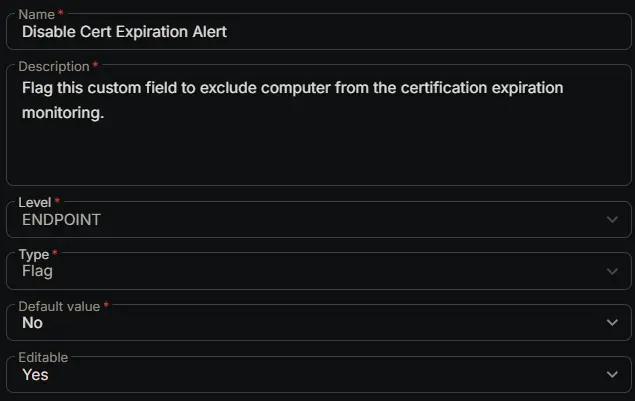

## Summary

Flag this custom field to exclude computer from the certification expiration monitoring.

## Dependencies

- [Solution: Certificate Expiration Monitoring](/docs/4712590e-18e7-47f7-a038-ab704f5859c2)

## Custom Field Setup Location

**Custom Fields Path:** `SETTINGS` ➞ `Custom Fields`  

## Details

| Name | Level | Type | Default Value | Editable | Description |
| ---- | ----- | ---- | ------------ | -------- | ----------- |
| Disable Cert Expiration Alert | ENDPOINT | Flag | No | Yes | Flag this custom field to exclude computer from the certification expiration monitoring. |

## Completed Custom Field

