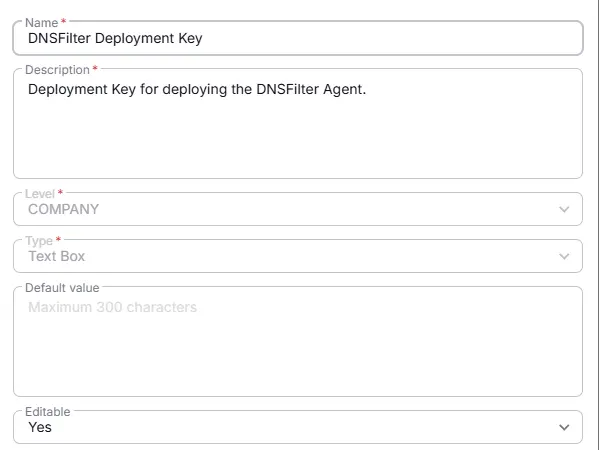

## Summary
Deployment Key for deploying the DNSFilter Agent.

## Details

| Name                 | Level                | Type                | Default         | Required | Editable | Description                              |
|----------------------|----------------------|---------------------|------------------|----------|----------|------------------------------------------|
| DNSFilter Deployment Key| Company | Text |  | True | Yes   | Deployment Key for deploying the DNSFilter Agent. |

## Completed Custom Field

