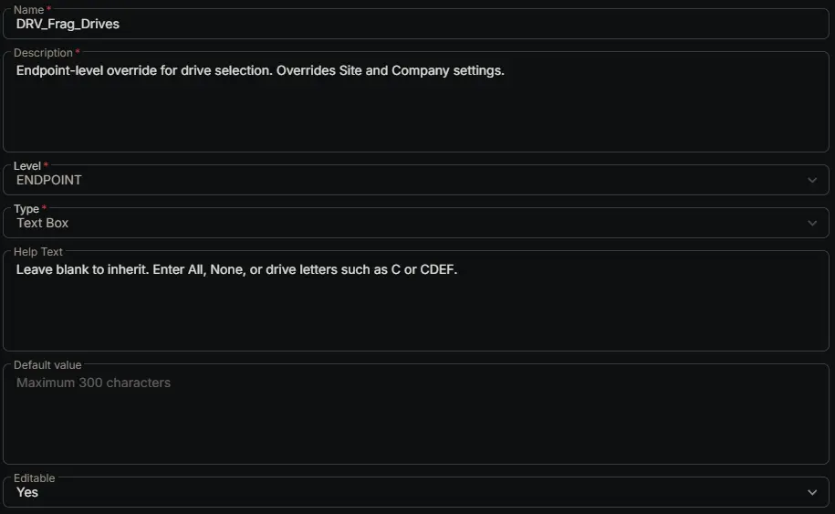

## Summary

Endpoint-level override for drive selection. Overrides Site and Company settings.

## Dependencies

- [Solution: Drive Fragmentation Monitoring](/docs/fb923e51-3cca-4b32-9066-51fbef06953f)

## Custom Field Setup Location

**Custom Fields Path:** SETTINGS ➞ Custom Fields

## Details

| Name | Description | Level | Type | Help Text | Default Value | Editable |
|---|---|---|---|---|---|---|
| DRV_Frag_Drives | Endpoint-level override for drive selection. Overrides Site and Company settings. | `Endpoint` | `Text Box` | Leave blank to inherit. Enter All, None, or drive letters such as C or CDEF. |  | `Yes` |

## Completed Custom Field

## Changelog

### 2026-08-26

- Initial version of the document
