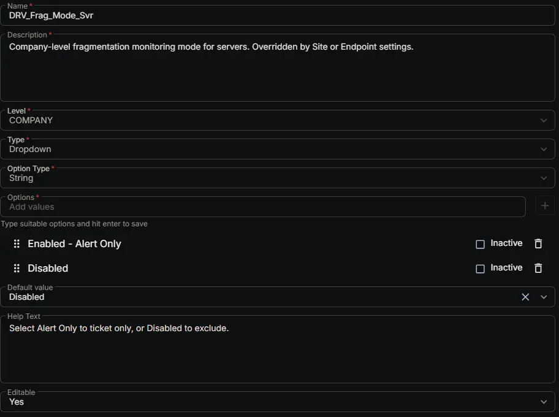

## Summary

Company-level fragmentation monitoring mode for servers. Overridden by Site or Endpoint settings.

## Dependencies

- [Solution: Drive Fragmentation Monitoring](/docs/fb923e51-3cca-4b32-9066-51fbef06953f)

## Custom Field Setup Location

**Custom Fields Path:** SETTINGS ➞ Custom Fields

## Details

| Name | Description | Level | Type | Option Type | Options | Help Text | Default Value | Editable |
|---|---|---|---|---|---|---|---|---|
| DRV_Frag_Mode_Svr | Company-level fragmentation monitoring mode for servers. Overridden by Site or Endpoint settings. | `Company` | `Dropdown` | `string` | `Enabled - Alert Only`, `Disabled` | Select Alert Only to ticket only, or Disabled to exclude. | `Disabled` | `Yes` |

## Completed Custom Field

## Changelog

### 2026-08-26

- Initial version of the document
