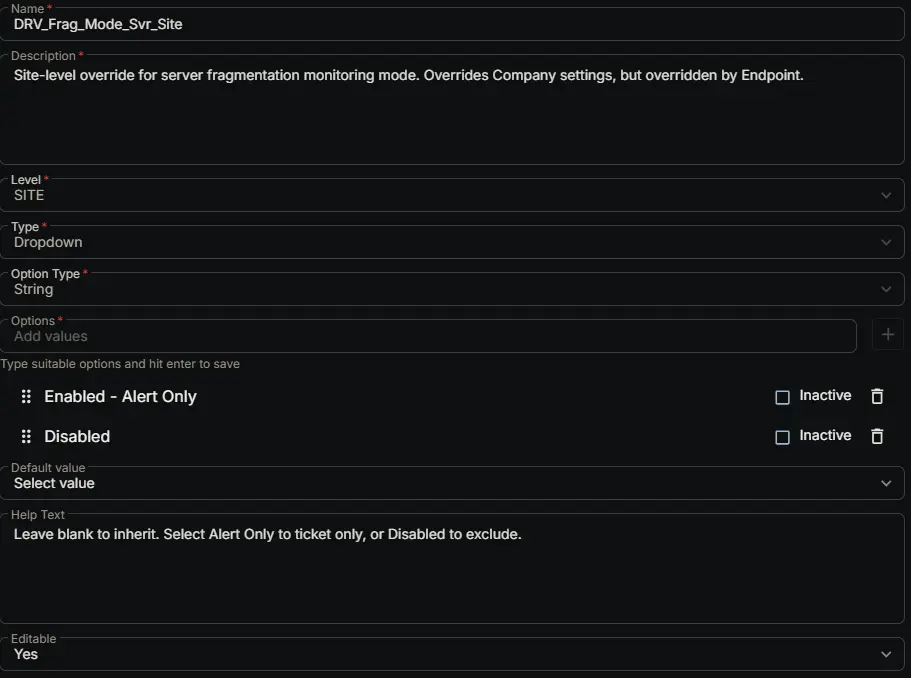

## Summary

Site-level override for server fragmentation monitoring mode. Overrides Company settings, but overridden by Endpoint.

## Dependencies

- [Solution: Drive Fragmentation Monitoring](/docs/fb923e51-3cca-4b32-9066-51fbef06953f)

## Custom Field Setup Location

**Custom Fields Path:** SETTINGS ➞ Custom Fields

## Details

| Name | Description | Level | Type | Option Type | Options | Help Text | Default Value | Editable |
|---|---|---|---|---|---|---|---|---|
| DRV_Frag_Mode_Svr_Site | Site-level override for server fragmentation monitoring mode. Overrides Company settings, but overridden by Endpoint. | `Site` | `Dropdown` | `string` | `Enabled - Alert Only`, `Disabled` | Leave blank to inherit. Select Alert Only to ticket only, or Disabled to exclude. |  | `Yes` |

## Completed Custom Field

## Changelog

### 2026-08-26

- Initial version of the document
