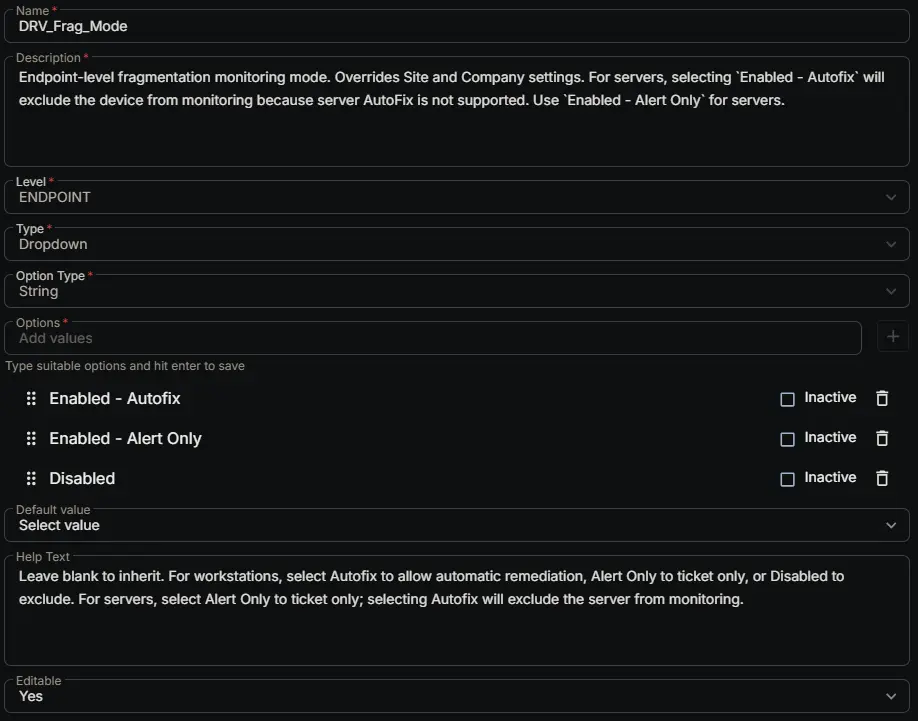

## Summary

Endpoint-level fragmentation monitoring mode. Overrides Site and Company settings. For servers, **selecting `Enabled - Autofix` will exclude the device from monitoring** because server AutoFix is not supported by the automation group. Use `Enabled - Alert Only` to monitor servers.

## Dependencies

- [Solution: Drive Fragmentation Monitoring](/docs/fb923e51-3cca-4b32-9066-51fbef06953f)

## Custom Field Setup Location

**Custom Fields Path:** SETTINGS ➞ Custom Fields

## Details

| Name | Description | Level | Type | Option Type | Options | Help Text | Default Value | Editable |
|---|---|---|---|---|---|---|---|---|
| DRV_Frag_Mode | Endpoint-level fragmentation monitoring mode. Overrides Site and Company settings. For servers, selecting `Enabled - Autofix` will exclude the device from monitoring because server AutoFix is not supported. Use `Enabled - Alert Only` for servers. | `Endpoint` | `Dropdown` | `string` | `Enabled - Autofix`, `Enabled - Alert Only`, `Disabled` | Leave blank to inherit. For workstations, select Autofix to allow automatic remediation, Alert Only to ticket only, or Disabled to exclude. For servers, select Alert Only to ticket only; selecting Autofix will exclude the server from monitoring. |  | `Yes` |

## Completed Custom Field

## Changelog

### 2026-08-26

- Initial version of the document.