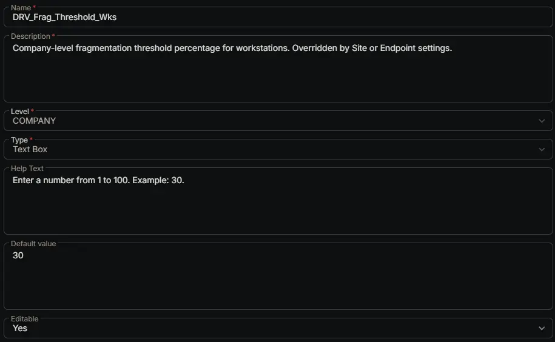

## Summary

Company-level fragmentation threshold percentage for workstations. Overridden by Site or Endpoint settings.

## Dependencies

- [Solution: Drive Fragmentation Monitoring](/docs/fb923e51-3cca-4b32-9066-51fbef06953f)

## Custom Field Setup Location

**Custom Fields Path:** SETTINGS ➞ Custom Fields

## Details

| Name | Description | Level | Type | Help Text | Default Value | Editable |
|---|---|---|---|---|---|---|
| DRV_Frag_Threshold_Wks | Company-level fragmentation threshold percentage for workstations. Overridden by Site or Endpoint settings. | `Company` | `Text Box` | Enter a number from 1 to 100. Example: 30. | `30` | `Yes` |

## Completed Custom Field

## Changelog

### 2026-08-26

- Initial version of the document
