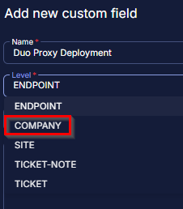
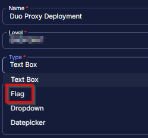
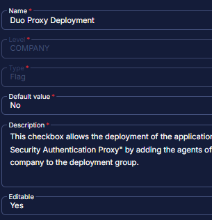

## Summary

The custom fields listed below are used in the DUO Auth Proxy Deployment Solution.

## Dependencies

## Details

| Name                       | Level   | Type | Required | Editable | Default Value? | Description                                                                                                        |
|----------------------------|---------|------|----------|----------|-----------------|--------------------------------------------------------------------------------------------------------------------|
| Duo Proxy Deployment       | Company | Flag | False    | Yes      | No              | This checkbox allows the deployment of the application "Duo Security Authentication Proxy" by adding the agents of the company to the deployment group. |
| DUO Proxy Exclusion        | Endpoint| Flag | False    | Yes      | No              | This checkbox excludes the agent from the deployment of the application "Duo Security Authentication Proxy".      |
| DUO Auth Proxy Result      | Company | Text | False    | No       | \<Blank>         | This stores the success or failure result from the script "DUO Auth Proxy - Install/Update Latest Version".      |

## Steps to Create Custom Fields

1. Go to Settings > Custom Fields  
   

2. Click the Add option  
   

3. Create Custom Field  
   Provide Name: Duo Proxy Deployment  
   Select Level: Company  
     
   Then check the Type option:  
   Type: Flag  
     
   Then provide Default Value and Description:  
   Default: No  
   Description: This checkbox allows the deployment of the application "Duo Security Authentication Proxy" by adding the agents of the company to the deployment group.  
   Editable: Yes  
     
   **Note:** The description is mandatory to fill out and does not accept **'NEW LINE'**. Write everything in one phrase to describe the details of the custom field.

4. Please follow the same steps to create other custom fields.

