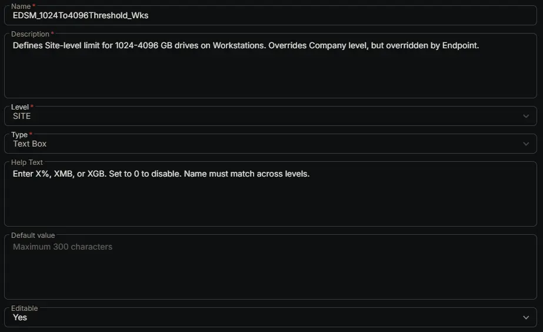

---
id: '25e977e3-ba91-44bc-9f8d-e7054b04e14c'
slug: /25e977e3-ba91-44bc-9f8d-e7054b04e14c
title: 'EDSM_1024To4096Threshold_Wks'
title_meta: 'EDSM_1024To4096Threshold_Wks'
keywords: ['monitoring', 'drive', 'space', 'thresholds', 'tickets']
description: 'Defines Site-level limit for 1024-4096 GB drives on Workstations. Overrides Company level, but overridden by Endpoint.'
tags: ['disk', 'monitoring', 'windows']
draft: false
unlisted: false
last_update:
  date: 2026-06-24
---

## Summary

Defines Site-level limit for 1024-4096 GB drives on Workstations. Overrides Company level, but overridden by Endpoint.

## Dependencies

- [Solution: Enhanced Drive Space Monitoring](/docs/e9cf4ff0-4413-447b-97dd-b8b2abd59597)

## Custom Field Setup Location

**Custom Fields Path:** SETTINGS ➞ Custom Fields

## Details

| Name | Description | Level | Type | Help Text | Default Value | Editable |
|---|---|---|---|---|---|---|
| EDSM_1024To4096Threshold_Wks | Defines Site-level limit for 1024-4096 GB drives on Workstations. Overrides Company level, but overridden by Endpoint. | `Site` | `Text Box` | Enter X%, XMB, or XGB. Set to 0 to disable. Name must match across levels. |  | `Yes` |

## Completed Custom Field

## Changelog

### 2026-06-24

- Initial version of the document
