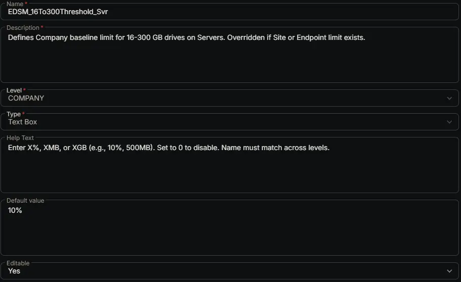

---
id: 'b6af6e72-388a-49e8-8cd1-658d240b8813'
slug: /b6af6e72-388a-49e8-8cd1-658d240b8813
title: 'EDSM_16To300Threshold_Svr'
title_meta: 'EDSM_16To300Threshold_Svr'
keywords: ['monitoring', 'drive', 'space', 'thresholds', 'tickets']
description: 'Defines Company baseline limit for 16-300 GB drives on Servers. Overridden if Site or Endpoint limit exists.'
tags: ['disk', 'monitoring', 'windows']
draft: false
unlisted: false
last_update:
  date: 2026-06-24
---

## Summary

Defines Company baseline limit for 16-300 GB drives on Servers. Overridden if Site or Endpoint limit exists.

## Dependencies

- [Solution: Enhanced Drive Space Monitoring](/docs/e9cf4ff0-4413-447b-97dd-b8b2abd59597)

## Custom Field Setup Location

**Custom Fields Path:** SETTINGS ➞ Custom Fields

## Details

| Name | Description | Level | Type | Help Text | Default Value | Editable |
|---|---|---|---|---|---|---|
| EDSM_16To300Threshold_Svr | Defines Company baseline limit for 16-300 GB drives on Servers. Overridden if Site or Endpoint limit exists. | `Company` | `Text Box` | Enter X%, XMB, or XGB (e.g., 10%, 500MB). Set to 0 to disable. Name must match across levels. | `10%` | `Yes` |

## Completed Custom Field

## Changelog

### 2026-06-24

- Initial version of the document
