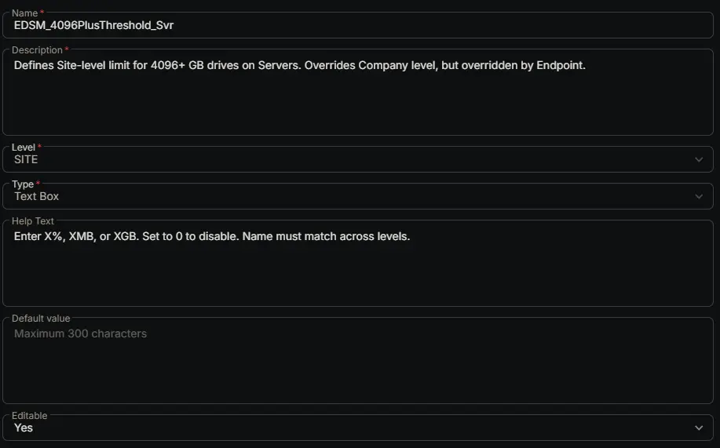

## Summary

Defines Site-level limit for 4096+ GB drives on Servers. Overrides Company level, but overridden by Endpoint.

## Dependencies

- [Solution: Enhanced Drive Space Monitoring](/docs/e9cf4ff0-4413-447b-97dd-b8b2abd59597)

## Custom Field Setup Location

**Custom Fields Path:** SETTINGS ➞ Custom Fields

## Details

| Name | Description | Level | Type | Help Text | Default Value | Editable |
|---|---|---|---|---|---|---|
| EDSM_4096PlusThreshold_Svr | Defines Site-level limit for 4096+ GB drives on Servers. Overrides Company level, but overridden by Endpoint. | `Site` | `Text Box` | Enter X%, XMB, or XGB. Set to 0 to disable. Name must match across levels. |  | `Yes` |

## Completed Custom Field

## Changelog

### 2026-06-24

- Initial version of the document
