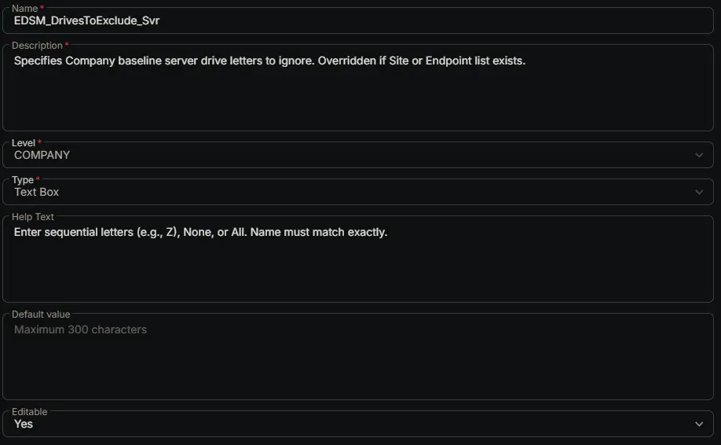

---
id: 'f8a71954-7137-4b26-90de-5bb495d1e991'
slug: /f8a71954-7137-4b26-90de-5bb495d1e991
title: 'EDSM_DrivesToExclude_Svr'
title_meta: 'EDSM_DrivesToExclude_Svr'
keywords: ['monitoring', 'drive', 'space', 'thresholds', 'tickets']
description: 'Specifies Company baseline server drive letters to ignore. Overridden if Site or Endpoint list exists.'
tags: ['disk', 'monitoring', 'windows']
draft: false
unlisted: false
last_update:
  date: 2026-06-24
---

## Summary

Specifies Company baseline server drive letters to ignore. Overridden if Site or Endpoint list exists.

## Dependencies

- [Solution: Enhanced Drive Space Monitoring](/docs/e9cf4ff0-4413-447b-97dd-b8b2abd59597)

## Custom Field Setup Location

**Custom Fields Path:** SETTINGS ➞ Custom Fields

## Details

| Name | Description | Level | Type | Help Text | Default Value | Editable |
|---|---|---|---|---|---|---|
| EDSM_DrivesToExclude_Svr | Specifies Company baseline server drive letters to ignore. Overridden if Site or Endpoint list exists. | `Company` | `Text Box` | Enter sequential letters (e.g., Z), None, or All. Name must match exactly. |  | `Yes` |

## Completed Custom Field

## Changelog

### 2026-06-24

- Initial version of the document
