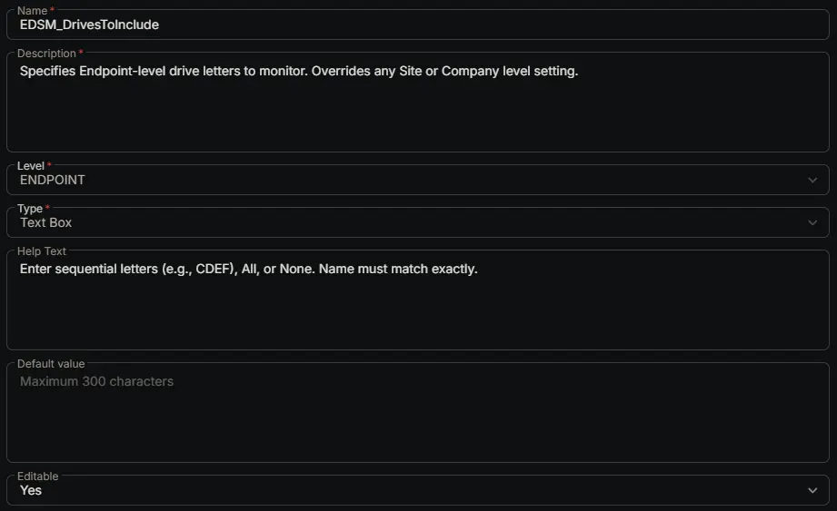

---
id: '7c0130ee-56b6-4c04-8e66-1fafaad73c6d'
slug: /7c0130ee-56b6-4c04-8e66-1fafaad73c6d
title: 'EDSM_DrivesToInclude'
title_meta: 'EDSM_DrivesToInclude'
keywords: ['monitoring', 'drive', 'space', 'thresholds', 'tickets']
description: 'Specifies Endpoint-level drive letters to monitor. Overrides any Site or Company level setting.'
tags: ['disk', 'monitoring', 'windows']
draft: false
unlisted: false
last_update:
  date: 2026-06-24
---

## Summary

Specifies Endpoint-level drive letters to monitor. Overrides any Site or Company level setting.

## Dependencies

- [Solution: Enhanced Drive Space Monitoring](/docs/e9cf4ff0-4413-447b-97dd-b8b2abd59597)

## Custom Field Setup Location

**Custom Fields Path:** SETTINGS ➞ Custom Fields

## Details

| Name | Description | Level | Type | Help Text | Default Value | Editable |
|---|---|---|---|---|---|---|
| EDSM_DrivesToInclude | Specifies Endpoint-level drive letters to monitor. Overrides any Site or Company level setting. | `Endpoint` | `Text Box` | Enter sequential letters (e.g., CDEF), All, or None. Name must match exactly. |  | `Yes` |

## Completed Custom Field

## Changelog

### 2026-06-24

- Initial version of the document
