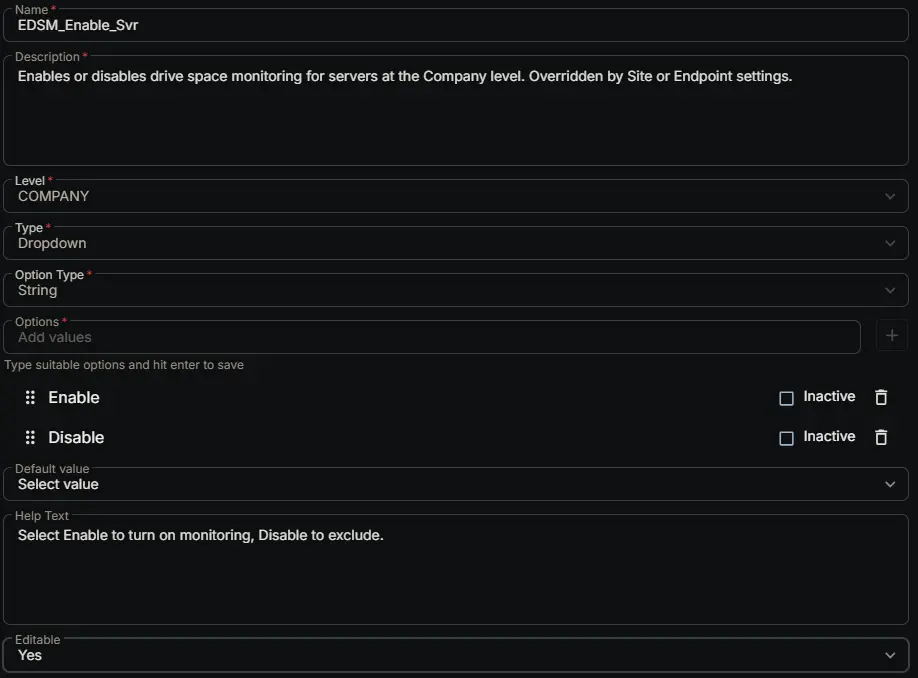

## Summary

Enables or disables drive space monitoring for servers at the Company level. Overridden by Site or Endpoint settings.

## Dependencies

- [Solution: Enhanced Drive Space Monitoring](/docs/e9cf4ff0-4413-447b-97dd-b8b2abd59597)

## Custom Field Setup Location

**Custom Fields Path:** SETTINGS ➞ Custom Fields

## Details

| Name | Description | Level | Type | Option Type | Options | Help Text | Default Value | Editable |
|---|---|---|---|---|---|---|---|---|
| EDSM_Enable_Svr | Enables or disables drive space monitoring for servers at the Company level. Overridden by Site or Endpoint settings. | `Company` | `Dropdown` | `String` | `Enable`, `Disable` | Select Enable to turn on monitoring, Disable to exclude. |  | `Yes` |

## Completed Custom Field

## Changelog

### 2026-06-24

- Initial version of the document
