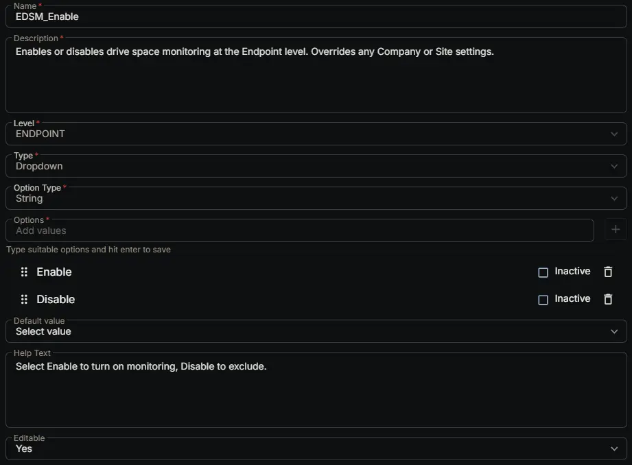

---
id: '82dfc50d-1a44-47dc-b719-4ac0e25e7010'
slug: /82dfc50d-1a44-47dc-b719-4ac0e25e7010
title: 'EDSM_Enable'
title_meta: 'EDSM_Enable'
keywords: ['monitoring', 'drive', 'space', 'thresholds', 'tickets']
description: 'Enables or disables drive space monitoring at the Endpoint level. Overrides any Company or Site settings.'
tags: ['disk', 'monitoring', 'windows']
draft: false
unlisted: false
last_update:
  date: 2026-06-24
---

## Summary

Enables or disables drive space monitoring at the Endpoint level. Overrides any Company or Site settings.

## Dependencies

- [Solution: Enhanced Drive Space Monitoring](/docs/e9cf4ff0-4413-447b-97dd-b8b2abd59597)

## Custom Field Setup Location

**Custom Fields Path:** SETTINGS ➞ Custom Fields

## Details

| Name | Description | Level | Type | Option Type | Options | Help Text | Default Value | Editable |
|---|---|---|---|---|---|---|---|---|
| EDSM_Enable | Enables or disables drive space monitoring at the Endpoint level. Overrides any Company or Site settings. | `Endpoint` | `Dropdown` | `String` | `Enable`, `Disable` | Select Enable to turn on monitoring, Disable to exclude. |  | `Yes` |

## Completed Custom Field

## Changelog

### 2026-06-24

- Initial version of the document
