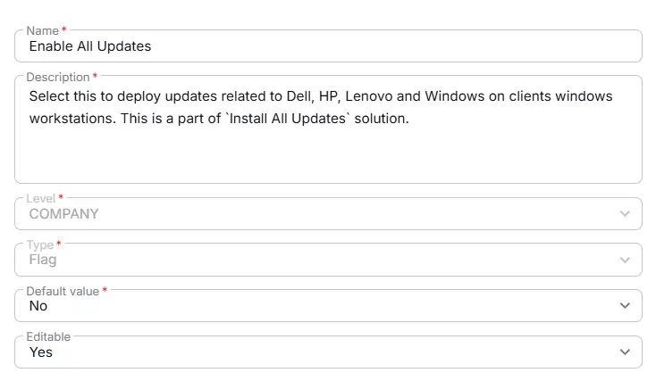

## Summary
Select this to deploy updates related to Dell, HP, Lenovo and Windows on clients windows workstations. This is a part of [Install All Updates](/docs/84a1de4d-0f17-407a-8c98-7ffc76e1d150) solution.

## Details

| Name                 | Level                | Type                | Default       | Editable | Description                              |
|----------------------|----------------------|---------------------|------------------|----------|------------------------------------------|
| Enable All Updates | Company | Checkbox | No |  Yes  | Select this to deploy updates related to Dell, HP, Lenovo and Windows on clients windows workstations. This is a part of "Install All Updates" solution. |

## Dependencies

- [Solution - Install All Updates](/docs/84a1de4d-0f17-407a-8c98-7ffc76e1d150)

## Creation Process

### Step 1

Navigate to `Settings` ➞ `Custom Fields`  

### Step 2

Locate the `Add Field` button on the right-hand side of the screen and click on it.  

## Step 3

The `Add new custom field` dialog box will occur

## Completed Custom Field

## Changelog

### 2026-04-21

- Initial version of the document
