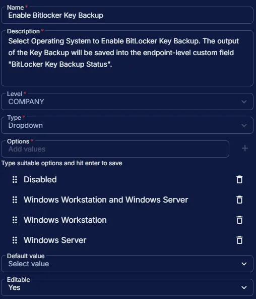

## Summary

Select Operating System to Enable BitLocker Key Backup. The output of the Key Backup will be saved into the endpoint-level custom field [BitLocker Key Backup Status](/docs/362c3958-f97e-4f40-bd1d-89cbfed9b17f). This custom field manages the auto-execution of the task. However, the [BitLocker Recovery Key Backup](/docs/b469ea90-0c1b-421b-89e2-be5c91501035) task can still be run manually, independent of this field.

## Dependencies

- [Solution - BitLocker Key Backup](/docs/fecda0ff-5a3e-4cc5-b6a7-fd37732aa2e9)

## Custom Field Setup Location

**Custom Fields Path:** `SETTINGS` ➞ `Custom Fields`  

## Details

| Name | Level | Type | Options | Default Value | Editable | Description |
| ---- | ----- | ---- | ------- | ------------- | -------- | ----------- |
| Enable BitLocker Key Backup | COMPANY | Dropdown | <ul><li>Disabled</li><li>Windows Workstation and Server</li><li>Windows Workstation</li><li>Windows Server</li></ul> | | Yes | Select Operating System to Enable BitLocker Key Backup. The output of the Key Backup will be saved into the endpoint-level custom field "BitLocker Key Backup Status". |

## Completed Custom Field

