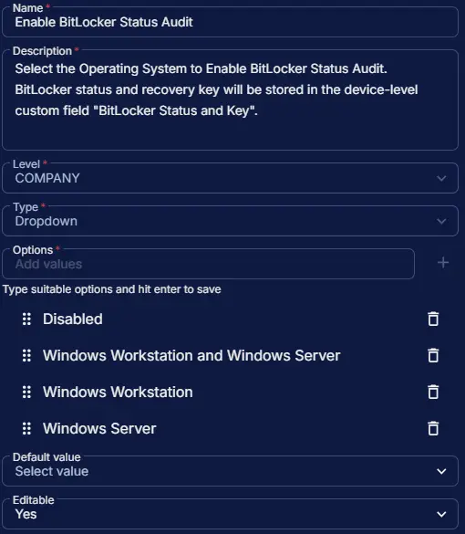

## Summary

Select the Operating System to Enable BitLocker Status Audit. BitLocker status and recovery key will be stored in the device-level custom field [BitLocker Status and Key](/docs/a7785954-5a6d-4003-9d0e-c919e1a96b0c). This custom field manages the auto-execution of the task. However, the [BitLocker Status and Recovery Key Audit](/docs/9682b5a8-d821-43f6-9b77-59d43b6ef015) task can still be run manually, independent of this field.

## Dependencies

- [Solution - BitLocker Status and Recovery Key Audit](/docs/b2a974b2-c231-4197-a639-d0775d77d7c7)

## Custom Field Setup Location

**Custom Fields Path:** `SETTINGS` ➞ `Custom Fields`  

## Details

| Name | Level | Type | Options | Default Value | Editable | Description |
| ---- | ----- | ---- | ------- | ------------- | -------- | ----------- |
| Enable BitLocker Status Audit | COMPANY | Dropdown | <ul><li>Disabled</li><li>Windows Workstation and Server</li><li>Windows Workstation</li><li>Windows Server</li></ul> | | Yes | Select the Operating System to Enable BitLocker Status Audit. BitLocker status and recovery key will be stored in the device-level custom field "BitLocker Status and Key". |

## Completed Custom Field

