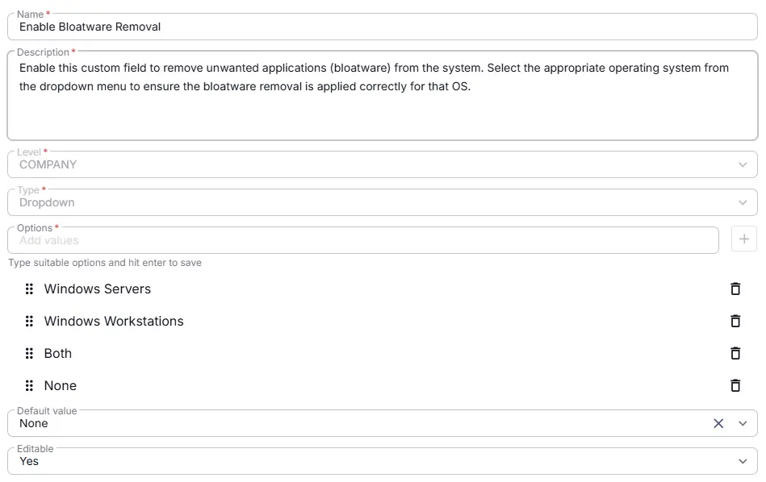

## Summary

This custom field is used to remove specified bloatware applications from the system. The applications to be removed must be explicitly listed in the `Bloatware to Remove` custom field. By default, this field is set to None. Select the appropriate operating system from the dropdown menu to ensure the bloatware removal is applied correctly for that OS.

## Dependencies

- [Solution - Remove Bloatware](/docs/0b1f4077-1cf3-43ea-9c9d-93e2db94e24f)

## Details

| Name                 | Level                | Type         | Options       | Default?         | Required | Editable | Description                              |
|----------------------|----------------------|---------------------|-------|----------------|----------|----------|------------------------------------------|
| Enable Bloatware Removal | Company | Dropdown |  <ul><li>None</li><li>Both</li><li>Windows Servers</li><li>Windows Workstations</li></ul>  | blank or Default Value | True | Yes  | Enable this custom field to remove unwanted applications (bloatware) from the system. Select the appropriate operating system from the dropdown menu to ensure the bloatware removal is applied correctly for that OS. |

## Completed Custom Field

## Changelog

### 2026-03-30

- Initial version of the document

