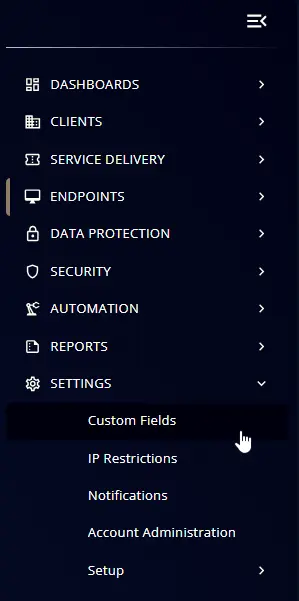
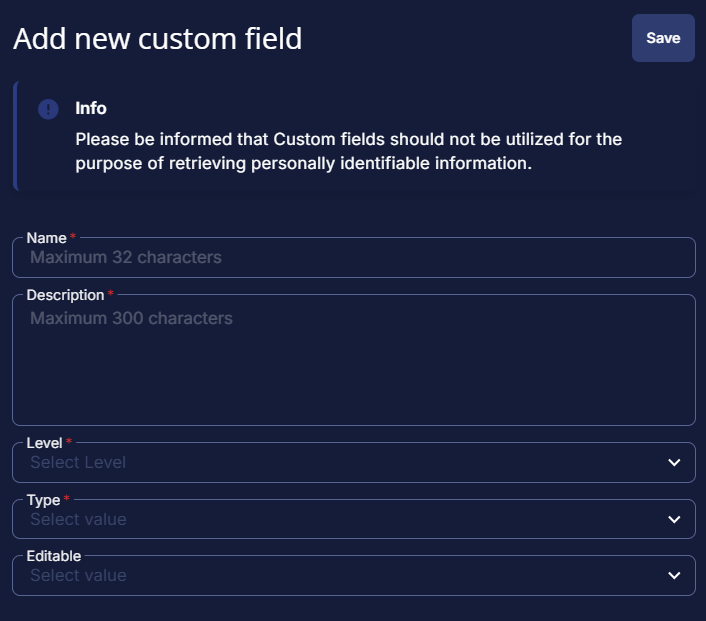
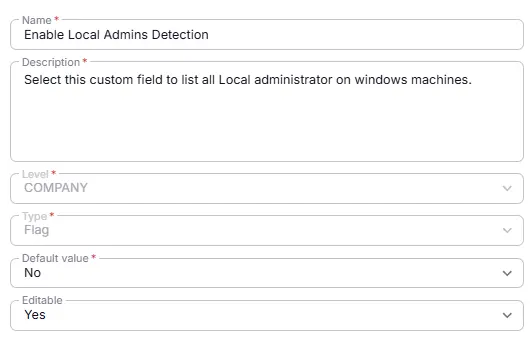

## Summary
Select this custom field at company level to list all Local administrator on windows machines.

## Details

| Name                 | Level                | Type                | Default       |  Editable | Description                              |
|----------------------|----------------------|---------------------|------------------|----------|------------------------------------------|
| Enable Local Admins Detection| Company | Flag | No | Yes   | Select this custom field to list all Local administrator on windows machines. |

## Dependencies

- [Solution - Local Administrator Detection](/docs/7e3f8472-2908-4491-b495-b87bd7ad0fe6) 

## Custom Field Setup Location

**Custom Fields Path:** `SETTINGS` ➞ `Custom Fields`

## Creation Process

### Step 1

Navigate to `Settings` ➞ `Custom Fields`  

### Step 2

Locate the `Add Field` button on the right-hand side of the screen and click on it.  

## Step 3

The `Add new custom field` dialog box will occur

## Completed Custom Field

## Changelog

### 2026-01-30

- Initial version of the document
