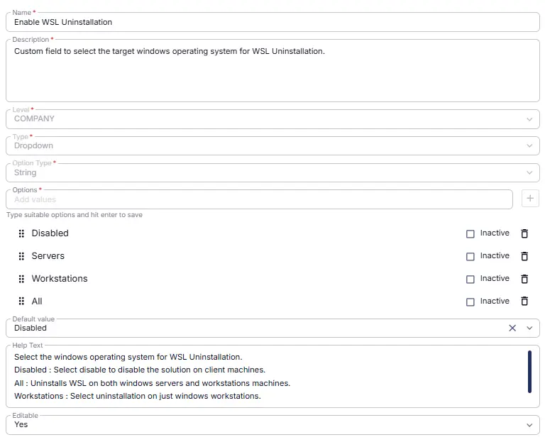

## Summary

Custom field to select the target windows operating system for WSL Uninstallation.

## Dependencies

- [Solution - CVE-2025-24084 - WSL Uninstall](/docs/cc418b50-c30e-4319-950e-ffa6347dd74e)  

## Details

**Custom Fields Path:** `SETTINGS` ➞ `Custom Fields`

| Name | Description | Level | Type | Option Type | Options | Help Text | Default Value | Editable |
|---|---|---|---|---|---|---|---|---|
| Enable WSL Uninstallation | Custom field to select the target windows operating system for WSL Uninstallation. |  Company | Dropdown | String | `Disabled`, `All`, `Workstations`, `Servers` | Select the windows operating system for WSL Uninstallation.  Disabled : Select disable to disable the solution on client machines.  All : Uninstalls WSL on both windows servers and workstations machines. Workstations : Select uninstallation on just windows workstations.  Servers : Select uninstallation on just windows servers. | - | `Yes` |

## Completed Custom Field

## Changelog

### 2026-09-16

- Initial version of the document
