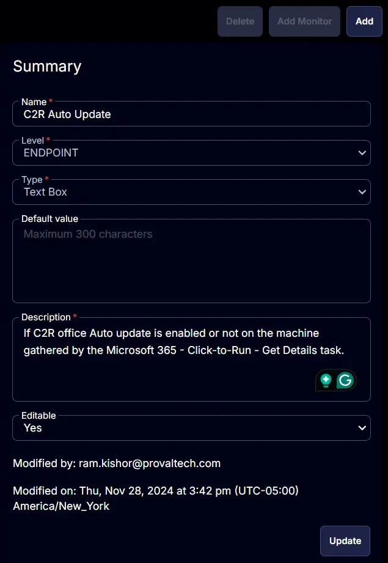

## Summary

This document outlines whether the C2R Office Auto Update feature is enabled on the machine, as gathered by the [Microsoft 365 - Click-to-Run - Get Details](/docs/f5099dd5-8e47-468f-a623-a245c342eb19) task.

## Details

| Field Name         | Level    | Type      | Default Value | Description                                                                                                           | Editable |
|--------------------|----------|-----------|---------------|-----------------------------------------------------------------------------------------------------------------------|----------|
| C2R Auto Update     | Endpoint | Text Box  | \<Blank>      | Indicates if the C2R Office Auto Update is enabled on the machine, as gathered by the Microsoft 365 - Click-to-Run - Get Details task. | Yes      |

## Screenshot

  

