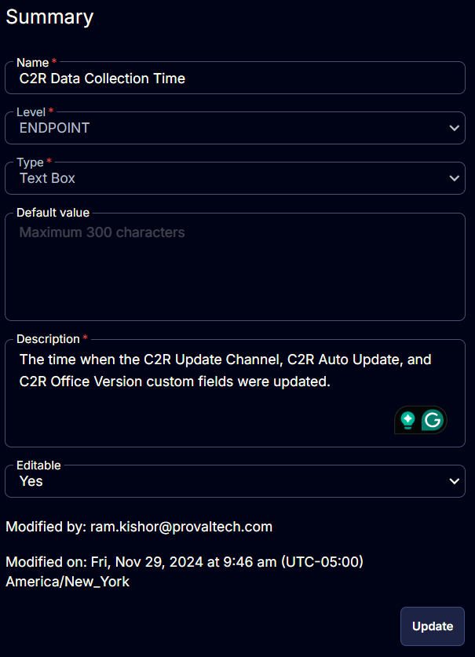

## Summary

This document outlines the time when the C2R Update Channel, C2R Auto Update, and C2R Office Version custom fields were last updated.

## Details

| Field Name                     | Level   | Type      | Default Value | Description                                                                                                 | Editable |
|--------------------------------|---------|-----------|---------------|-------------------------------------------------------------------------------------------------------------|----------|
| C2R Data Collection Time       | Company | Text Box  | \<Blank>      | The time when the C2R Update Channel, C2R Auto Update, and C2R Office Version custom fields were updated. | Yes      |

## Screenshots

