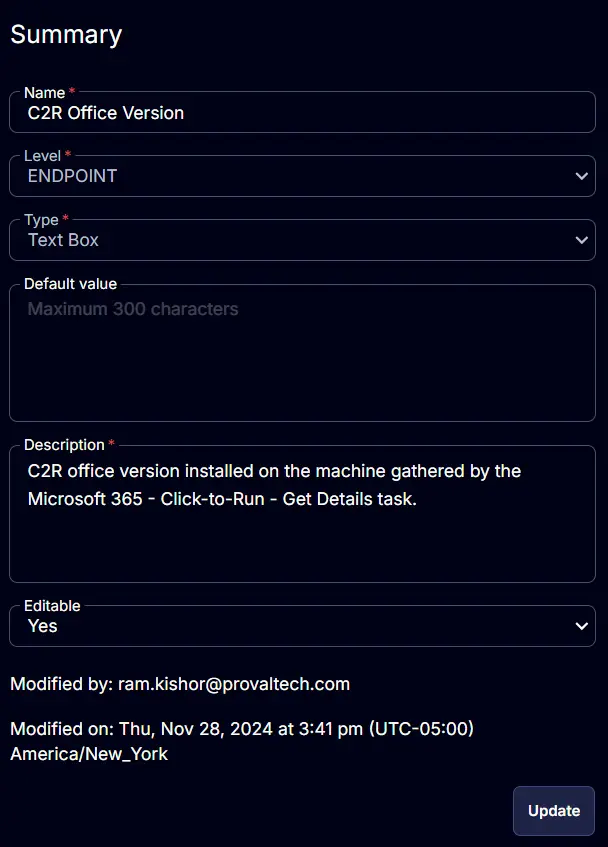

## Summary

This document provides details about the C2R Office version installed on the machine, gathered by the [Microsoft 365 - Click-to-Run - Get Details](/docs/f5099dd5-8e47-468f-a623-a245c342eb19) task.

## Details

| Field Name          | Level    | Type      | Default Value | Description                                                                                     | Editable |
|---------------------|----------|-----------|---------------|-------------------------------------------------------------------------------------------------|----------|
| C2R Office Version   | Endpoint | Text Box  | \<Blank>       | C2R Office version installed on the machine, gathered by the Microsoft 365 - Click-to-Run - Get Details task. | Yes      |

## Screenshots

  
