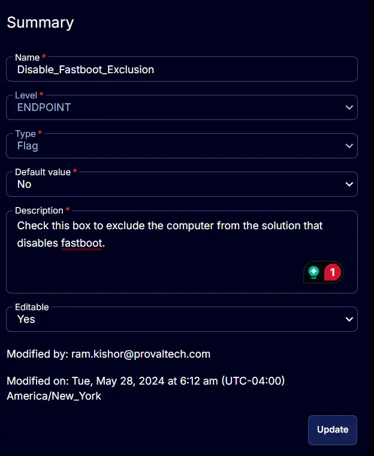

## Summary

Check this box to exclude the computer from the solution that disables fastboot.

## Details

| Field Name                     | Level    | Type  | Default Value | Description                                                                | Editable |
|--------------------------------|----------|-------|---------------|----------------------------------------------------------------------------|----------|
| Disable_Fastboot_Exclusion     | ENDPOINT | Flag  | No            | Check this box to exclude the computer from the solution that disables fastboot. | Yes      |

## Screenshots

