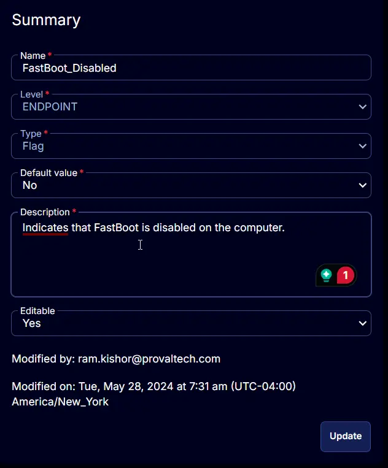

## Summary

Indicates that FastBoot has been disabled on the computer.

## Details

| Field Name          | Level    | Type  | Default Value | Description                                             | Editable |
|---------------------|----------|-------|---------------|---------------------------------------------------------|----------|
| FastBoot_Disabled    | ENDPOINT | Flag  | No            | Indicates that FastBoot has been disabled on the computer. | Yes      |

## Screenshot

