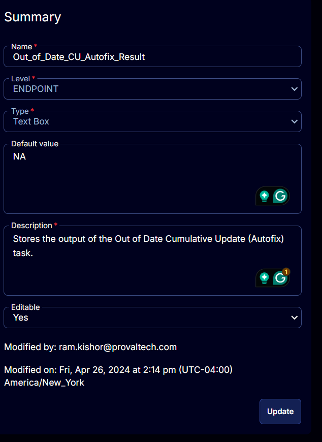

## Summary

This document stores the output of the Out of Date Cumulative Update (Autofix) task.

## Possible Values

- Failed
- Reboot Pending
- Installed

## Details

| Field Name                      | Level    | Type      | Default Value | Description                                                       | Editable |
|----------------------------------|----------|-----------|---------------|-------------------------------------------------------------------|----------|
| Out_of_Date_CU_Autofix_Result | ENDPOINT | Text Box  | NA            | Stores the output of the Out of Date Cumulative Update (Autofix) task. | Yes      |

## Screenshots

