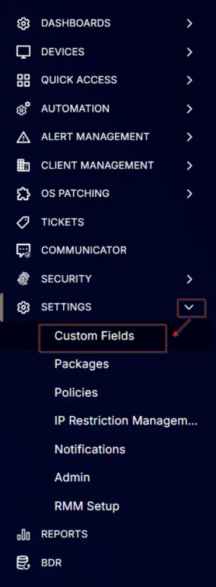

## Summary

The Windows 11 compatibility check indicates whether the computer meets the requirements for installing Windows 11.

## Details

| Field Name                | Level    | Type     | Options                     | Default Value | Description                                                                                              | Editable |
|---------------------------|----------|----------|-----------------------------|---------------|----------------------------------------------------------------------------------------------------------|----------|
| Windows 11 Compatible      | Endpoint | Dropdown | `Yes`, `No`, `NA`          | NA            | Indicates if the computer meets the requirements for installing Windows 11.                             | Yes      |

## Screenshots

  

