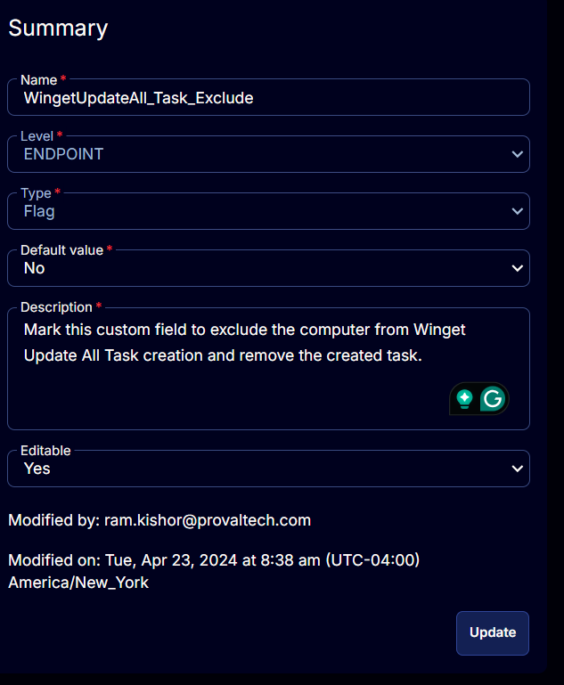

## Summary

Mark this custom field to exclude the computer from Winget Update All Task creation and remove the created tasks for the machine.

Marking this custom field will exclude the machine from the [CW RMM - Machine Group - Winget Update All (Task Delete)](/docs/a8ce29e2-502c-4bb8-a959-c7eb59e38808) group. The [CW RMM - Task - Scheduled Task Winget Update All (Create)](/docs/a898b5ac-23d0-4e0d-89e5-79bca2277a6e) task will not run on the computer with this custom field marked.

## Details

| Field Name                        | Level    | Type | Default Value | Description                                                                 | Editable |
|-----------------------------------|----------|------|---------------|-----------------------------------------------------------------------------|----------|
| WingetUpdateAll_Task_Exclude      | ENDPOINT | Flag | No            | Mark this custom field to exclude the computer from Winget Update All Task creation and remove the created task. | Yes      |

## Screenshots

 

