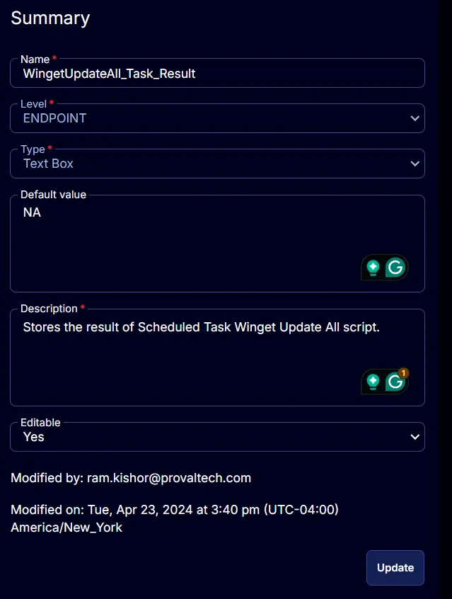

## Summary

This custom field stores the outcome of both [CW RMM - Task - Scheduled Task Winget Update All (Create)](/docs/a898b5ac-23d0-4e0d-89e5-79bca2277a6e) and [CW RMM - Task - Scheduled Task Winget Update All (Delete)](/docs/aca364ec-208f-47e8-a838-11b8ee0c9f95) tasks. It indicates whether the task succeeded or failed.

Possible values:
- NA
- Task Created
- Task Creation Failed
- Task Deleted
- Task Deletion Failed

## Details

| Field Name                          | Level    | Type      | Default Value | Description                                         | Editable |
|-------------------------------------|----------|-----------|---------------|-----------------------------------------------------|----------|
| WingetUpdateAll_Task_Result         | ENDPOINT | Text Box  | NA            | Stores the result of the Scheduled Task Winget Update All script. | Yes      |

## Screenshots

