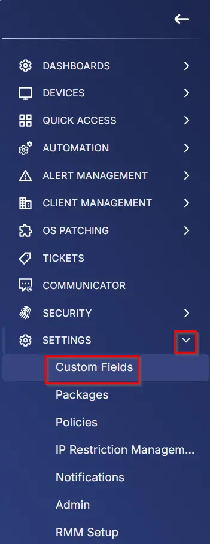
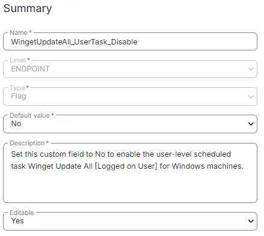

## Summary

Set this custom field to "No" to enable the user-level scheduled task `Winget Update All [Logged on User]` for Windows machines.

The [CW RMM - Task - Scheduled Task Winget Update All (Create)](/docs/a898b5ac-23d0-4e0d-89e5-79bca2277a6e) task will not enable the user-level Winget to update all scheduled tasks by default, as it is set to "Yes".

## Details

| Field Name                             | Level    | Type | Default Value | Description                                                                                                           | Editable |
|----------------------------------------|----------|------|---------------|-----------------------------------------------------------------------------------------------------------------------|----------|
| WingetUpdateAll_UserTask_Disable      | ENDPOINT | Flag | No            | Set this custom field to "Yes" to disable the user-level scheduled task `Winget Update All [Logged on User]` for Windows 10 and 11 on Windows machines. | Yes      |

## Screenshots

